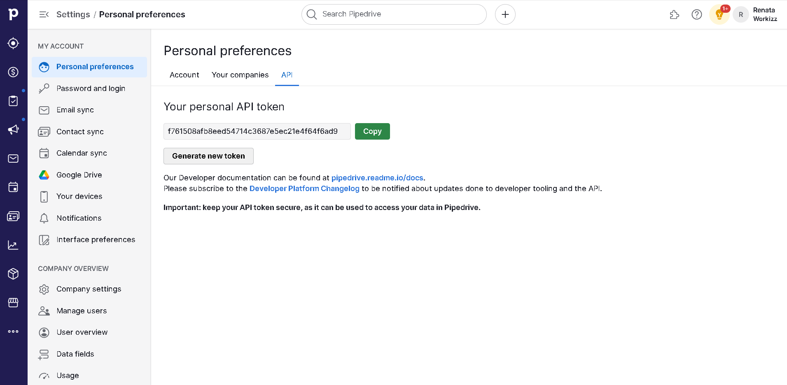
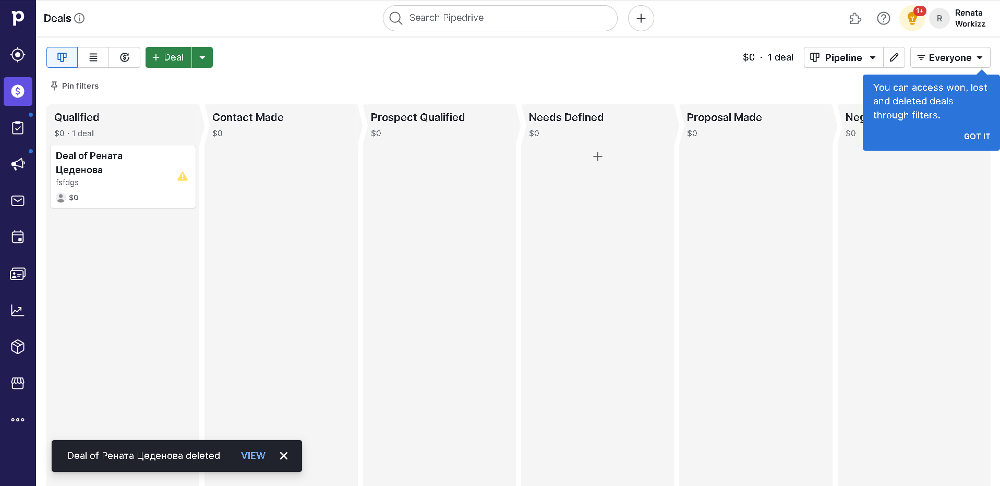

# Little training in using API 

This project is represented by an iframe form that transmits data to the pipedrive and creates a deal.

## You can try it

### Note
It is assumed that you already have a Node.js project. If not, run npm init before installing dependencies. 

- Step 1

Register on Pipedrive and create your organization: https://www.pipedrive.com/ru

- Step 2

Find your API key in section called "Personal preferences"



- Step 3

Copy this repo
```
git clone https://github.com/rtsedenova/iframe-form-for-pipedriveAPI.git
```
Install all dependencies
```
npm i express dotenv cors nodemon pipedrive --save-dev
```

Change your script on
```
"scripts": {
    "start": "nodemon <your_js_file>"
  }
```
to update changes automatically.

Alse create .env and paste there your API key.

- Step 4

Run code and open http://localhost:{port} in your browser. Then fill out the form and check pipedrive. 
A deal should emerge.



